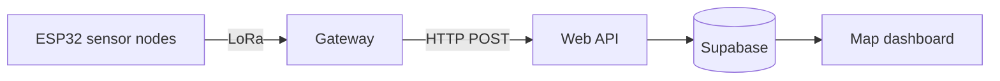

EMBEDDED SYSTEMS / FIELD-TESTED TEAM PROTOTYPE

A distributed sensor-network prototype linking ESP32 temperature and humidity nodes to a gateway over LoRa, then displaying readings on a web dashboard.

[Source and development log](https://github.com/conboy/LoRa-Wildfire-Detection-System)

## System architecture

Sensor nodes send readings over the radio link. The gateway forwards data to an API, which updates a Supabase database. The dashboard polls node data and displays it on a map.

The sensor-to-gateway link uses LoRa; the gateway-to-web path requires connectivity. This is a sensing prototype, not a validated wildfire warning service.

## Field test and my involvement

The project log records an outdoor test in which Ryan and I operated the sensor node while Luka and Matt moved the gateway farther away. Packets were sent every two seconds; the documented maximum distance was **300 metres in a semi-forested area** before the link was lost.

The result prompted the team to investigate transmit power and antenna changes. It is the measured result reported here, rather than a theoretical LoRa range.

_Hardware photograph from the project's public development log._

## Integration evidence

The log also documents gateway POST requests reaching the API and the subsequent database integration. The dashboard updated its map from node records every ten seconds, including temperature, location, and last-update time.

This project demonstrates integration across physical sensing, radio communication, and a web application. It also shows why field measurements belong alongside the architecture diagram.

[Read the original field-test log](https://github.com/conboy/LoRa-Wildfire-Detection-System#dev-logs) · [Back to portfolio](/)
